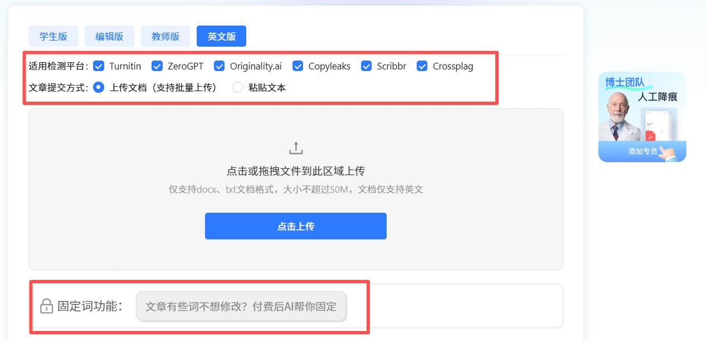

# Essay 总被判 AI 生成？实测好用英文降 ai 率工具！AI 率从 83% 压至个位数

不少留子应该都碰到过这种糟心情况，辛辛苦苦写完课程 Essay，拿去做**英文 ai 率检测**，AI 疑似度直接冲到 80% 以上。现在**turnitin**更新算法之后审核变严，不管用 ZeroGPT、**AI Detector**、**Copyleaks** 还是 Originality 这类**AI Checker**测试，AIGC 指标经常大片标蓝。我之前也到处找**免费在线查 ai 率英文**、**英文 aigc 检测免费**渠道反复自测，踩了一堆坑之后，总算摸懂怎么做**英文降 ai 率**，做好 **Humanize AI** 真人化处理，今天把实操经验分享出来。

## 一、新版 Turnitin，为什么很容易出现误判？

很多同学都会有这个疑问：明明整篇论文都是自己写的，也没有使用** AI 辅助**，为什么检测结果还是不太理想？其实，AI 检测并不只是看某几个词或重复率，还会综合分析整篇文本的语言和写作特征。

- **AI 标志**性的句式和表达：如果文章结构特别规整、句式高度统一，单纯替换几个单词，整体风格可能还是比较接近原来的表达。

- **行文节奏过于统一**：真人写作往往会有长短句变化和不同的表达习惯，而一篇文章如果从头到尾都过于平滑、整齐，读感上可能更像经过统一生成。

- **检测模型持续更新**：现在的检测工具会不断调整模型和样本，因此过去简单换词、调语序的 **Humanize AI** 做法，并不能保证检测结果发生明显变化。

非母语写出来的学术英文，行文工整、逻辑规整，刚好契合 **AI 文本特征**，很容易被打上高疑似标记。而且这次算法更新没有缓冲时间，海外院校直接上线，很多同学完全来不及调整。

## 二、无滤镜实测：笔灵 AI 应对新版 AI 检测

很多老的改写工具跟不上 2026 的检测更新，效果大打折扣。踩过不少坑之后，我日常会用笔灵 AI，适配当下主流检测平台，实际表现比较稳定。

传送门：[笔灵英文降ai ](https://ibiling.cn/paper-pass)[https://ibiling\.cn/paper\-pass/english](https://ibiling.cn/paper-pass)

拿我一篇 AI 疑似度 83% 的课程 Essay 完整实测：

- 第一轮基础优化：打散机器固化句式，消解**明显 AI 特征**，AI 率从 83% 下降到 17%，脱离高危区间；

- 第二轮精细精修：调整长短句排布，打磨行文语感，最终 AI 率降到 8%；

- 全平台复测：顺利通过 **turnitin、ZeroGPT、Copyleaks、Originality、AI Detector **多平台**英文 ai 率检测**，不再出现大面积标蓝。

它和普通同义词洗稿工具不一样，核心思路是模拟真人写作重构文本。制造真人写作特有的长短句错落，打破 AI 死板模板，重组段落逻辑，摒弃机器那种过于顺滑的过渡表达，从根源**降低 AIGC 特征**。

同时解决留学生几个很现实的痛点：可以锁定专业名词、实验数据、核心论点，改写只优化句式语感，不会改动学术内容，避免专业表述出错；保留正式学术文风，不会改得口语化幼稚；改写前后字数浮动很小，贴合学校 Essay 的字数标准。

文档支持 docx、txt 直接上传，整篇批量处理，改写完成后完整保留排版、表格、公式和注释，不需要花大量时间重新排版，赶 DDL 的时候很省心。

## 三、为什么新版检测环境下笔灵 AI 还能保持效果？

市面上很多工具翻车，根源是模型没有同步迭代，跟不上 turnitin 以及各类海外检测器的规则变化。 笔灵 AI 会持续跟进各大平台算法更新，持续做对抗训练优化** Humanize AI **真人改写逻辑，适配不断变化的识别规则，降低改完之后复测翻车的概率。

这里分享几个实操小要点，进一步降低踩坑概率：

- 定稿前，可以使用**免费在线查 ai 率英文**、**英文 aigc 检测免费**工具做多轮复测；

- 工具改写结束务必人工通读，微调语句，贴合自己平时的写作习惯；

- 工具只是辅助手段，论文核心观点、论据、逻辑必须自己把控。

## 四、写在最后

2026 年** turnitin 检测**收紧已经是客观现状，不少认真写作业的留学生都遇到过误判。与其熬夜一遍遍手动改写，不停试各种不靠谱工具，不如选适配新版规则的方案。

身边不少同学，通过**笔灵 AI **把偏高的 **AI 疑似度**降到安全个位数，顺利完成提交。当然，遵守学术规范是底线，但我们同样可以保护自己熬夜产出的文稿成果。希望大家都可以避开** AIGC 误判**困扰，论文作业顺利定稿。

